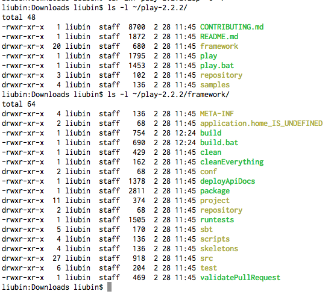
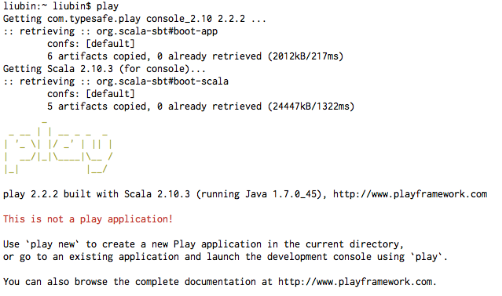

# 安装Play Framework

## 系统要求

安装Play需要JDK 6或以上，我想你应该已经满足这个条件了吧。如果还没有的话，你可能需要重新构建一下你的Java环境。

别忘了，设置`JAVA_HOME`，并把`java`和`javac`所在目录放到`PATH`里。

## 下载Play安装包

要想是用Play的话，你有两个二进制包可以选择：

### 使用标准Play包

标准版Play，也叫做"CLASSIC DISTRIBUTION"，只包含Play的命令行工具及一些例子，没有其它额外的东西，文件大小会小不少。

### 使用Typesafe Activator

你可以通过Typesafe Activator （*注 1*）来安装Play。Typesafe Activator是一个基于浏览器或者命令行的一个工具，用来帮助开发者使用Typesafe Reactive Platform平台。

Typesafe Reactive Platform是一个基于JVM的运行时环境和工具包，开发者可以用它来构建活性应用（Reactive application），它目前包括了Play Framework、Akka和Scala等技术。

什么是活性应用（Reactive application）呢？根据Typesafe的定义（*注 2*），认为活性应用区别于传统的Web应用或者桌面应用以及手机应用，它具有如下特点：

- 事件驱动

能轻松地进行并发、异步消息或事件处理

- 可扩展

可进行按需的在单机上或者集群中进行动态扩展

- 自恢复的

程序可以自己修复(repair)或恢复(recover)，以保证业务能不间断的提供服务。

- 响应式（Responsive）

提供丰富、单页应用等用户界面，并且能对用户操作进行及时反馈。

关于如何Typesafe的详细信息，可以参考这个网址：<http://typesafe.com/platform/getstarted>。

不过本书将以使用标准Play包为例进行说明，这样会更通用一些。

## 安装标准Play包

### 下载Play安装包

你可以到<http://www.playframework.com/download>来下载标准的Play包，目前页面布局的话下载链接在右边，"CLASSIC DISTRIBUTION"那一栏。

目前的最新版本是2.2.2，发布于2014年3月1号，大小为108M，你可以直接点击这里下载：<http://downloads.typesafe.com/play/2.2.2/play-2.2.2.zip>最新的压缩包。

### 解压Play安装包

首先，将下载的安装包进行解压。我们需要将它解压到一个当前OS用户拥有读写权限的地方，而且运行Play的时候会写一些它目录下的文件，所以尽量不要将它安装到系统的文件夹下。

这里我们以安装到用户HOME下为例进行说明。假设我们上面已经下载了Play的最新版本，那么执行下面命令解压即可：

`
$ tar zxf play-2.2.2.zip -C ~/
`

解压缩之后，我们会看到`/Users/liubin/play-2.2.2`文件夹已经生成了，并且里面有`play`这个可执行文件，这就是Play的命令行工具。

如果你解压后的文件不具备可执行权限的话，那么需要`chmod`命令来设置此权限，比如：

`
chmod a+x play
chmod a+x framework/build
`

最后需要确保下面的文件都有可执行权限，如下图 20-1 中绿色所示：

注意：如果你是Windows用户的话，最好不要将它解压到带空格的文件夹里去，否则后面很可能会遇到麻烦。就我本人而言，不管在什么OS系统下，文件名都不会包含空格、汉字等。

### 添加到`PATH`环境变量

光解压还不行，我们还需要将它放到`PATH`里去。在自己的`profile`文件里加入如下设置即可：

`
export PATH=$PATH:~/play-2.2.2/
`

如果你是Windows系统的话，可以在系统管理里修改环境变量。

在Mac或者Linux下，修改完`profile`文件后，需要执行`source`命令使之生效：

`
$ source ~/.profile
`

在做完上述两步之后，应该就可以运行`play`命令了，我们可以简单确认下：

`
$ play
`

如果不带任何参数，则程序输出如下：

这样就说明Play已经安装成功了。从下一小节开始，我们就将一步步的学习如何使用Play来开发Web应用程序。期待吧，少年。

*注 1：<http://typesafe.com/activator>*

*注 2：<https://typesafe.com/platform>*
