# 开始使用Play

安装好Play之后，我们就可以使用它来创建我们的第一个应用程序了。

## 创建新项目

创建新项目可以使用`play new`命令。

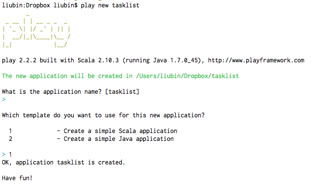

### 项目目录结构

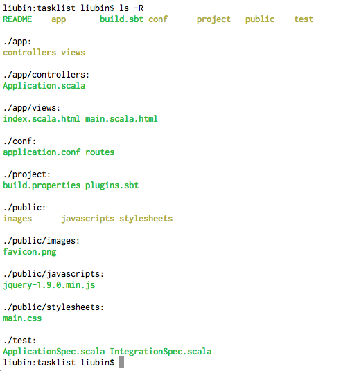

- app/

应用程序的核心代码都会放到这里，包括controllers，models，views等文件夹。此外，需要编译的资源文件也需要保存到`app/assets`下，比如LESS（*注 1*）和CoffeeScript（*注 2*）的源代码。

- conf/

存放着应用的所有配置文件，包括`application.conf`，这是Play应用的最重要的配置文件了，`routes`则是路由配置文件。用于国际化的各国语言翻译文件（messages files）也需要保存在这个文件夹下面。

- project/

包含基于sbt的应用构建脚本。

- public/

保存的是所有公开可见的资源，包JavaScript，样式表，图像等文件夹。

- test/

存放基于Specs2标准编写的测试代码。


- build.sbt

用来构建项目的脚本。

- lib/

这个文件夹是可选的，默认不会创建。如果你有不需要构建脚本来维持依赖关系的库的话，可以将它们保存到这里。

- target/

应用构建（build）之后产生的结果都会保存在这个文件夹下面，在这里你能清楚的知道应用构建后都产生了哪些文件。这其中大部分内容都保存在了`scala-x.yy`格式的文件夹下面。
比如`classes/`保存了所有编译后的.class文件，`classes_managed/`保存了由framework管理的class文件，包括路由等产生的.class文件，`resource_managed/`保存的是LESS或CoffeeScript等编译后的结果文件，`src_managed/`保存的则是应用build时产生的源文件，比如路由或者模板系统等产生的源文件。

*注 1：<http://lesscss.org/>*  
*注 2：<http://jashkenas.github.com/coffee-script/>*

Play只支持UTF-8编码的文本文件，所以如果你在Windows下需要注意了。在其它系统下也要确保文件都是以UTF-8编码保存的。通常出了修改操作系统的默认编码之外，你也可以通过设置你所用的编辑器或者IDE来配置文件编码。

### 启动服务器

可以通过`play run`来启动服务器，如下图所示。

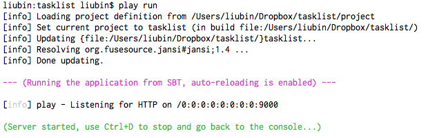


可以看出，Play默认监听的端口是9000，这时候我们在浏览器里打开<http://localhost:9000>，就应该可以看到默认的页面了。

不过第一次访问的时候，在控制台上回出现如下信息。

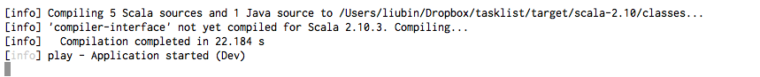

这是因为我们还没有对源代码进行过编译。从上面的信息可以看出，全编译一遍项目（目前文件还很少）还是挺耗时的。

编译后在浏览器就能看到默认的Play页面了。

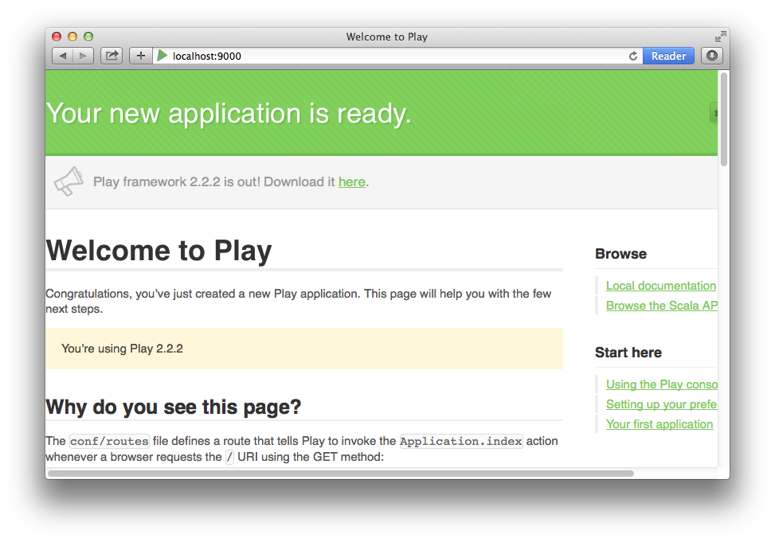

## 这一切都是如何工作的

在开始编写自己的代码之前，我们先来简单看看Play是如何工作的。

### 路由配置

首先，我们需要看一下路由配置文件，它的位置在`conf/routes`，刚生成的时候它的内容是这样的（去掉注释后）。

```
GET     /                           controllers.Application.index
GET     /assets/*file               controllers.Assets.at(path="/public", file)
```

路由配置的格式为：

```
HTTP方法  URL   控制器.方法
```

如果你稍微有点MVC的背景的话，应该很容易猜到第一行的作用是当浏览器访问根目录（即网站的根目录，域名后面没有任何东西），Play会将请求转交给类`controllers.Application`的`index`这个action（Application类的一个方法）。

实际上路由除了访问转发之外，还会做数据绑定（binding）等工作，我们在后面详细介绍。

第二行URL的`*file`指的是匹配任何文件，也包括文件路径中带'/'的。如果不写这个`*`，那么路径中带'/'的URL不会被匹配到，比如`/assets/images/2014/03/20/asfd34gse4t34.png`这样的路径。

`controllers.Assets`是Play内置的处理资源文件的控制器。

### 控制器

再来看看`controllers.Application`，它的位置在`app/controllers/Application.scala`，内容如下：

```scala
package controllers

import play.api._
import play.api.mvc._

object Application extends Controller {

  def index = Action {
    Ok(views.html.index("Your new application is ready."))
  }

}
```

我们看到`controllers.Application.index`返回的是`Action`类型，它会处理HTTP请求。一个`Action`必须返回一个`Result`，这个`Result`会保护HTTP响应。

在这个例子里，返回的内容是一个由模板产生的HTML内容。Play的模板会被编译为标准的Scala函数，在这个例子，这个函数是`views.html.index(message: String)`。

模板源文件保存在`app/views/index.scala.html`，其内容为。

```scala
@(message: String)

@main("Welcome to Play") {

    @play20.welcome(message)

}
```
在模板里Scala语句以`@`开头。

第一行定义了它可以接收的参数，这里是一个`String`类型的参数`message`。

`@main`实际上是调用了`main`的模板方法，将`main`模板（可以认为类似Rails里的layout文件）文件的内容混合（mixin）进来。

`main`模板也在相同文件夹下，内容如下。

```
@(title: String)(content: Html)

<!DOCTYPE html>

<html>
    <head>
        <title>@title</title>
        <link rel="stylesheet" media="screen" href="@routes.Assets.at("stylesheets/main.css")">
        <link rel="shortcut icon" type="image/png" href="@routes.Assets.at("images/favicon.png")">
        <script src="@routes.Assets.at("javascripts/jquery-1.9.0.min.js")" type="text/javascript"></script>
    </head>
    <body>
        @content
    </body>
</html>


```

怎么样是不是很像Rails，`@title`通过方法穿过来，而`@content`则通过block传过来。

不过等等，这里的`main`模板也很简单，怎么看到的页面那么多内容呢？我只传了个"Your new application is ready."啊。

一切奥秘都在`@play20.welcome(message)`这句话里，它的源代码在`$PLAY_HOME/framework/src/play/src/main/scala/views/play20/welcome.scala.html`，你看一下代码自然会恍然大悟的。

我们尝试修改`app/views/index.scala.html`为如下内容。

```scala
@(message: String)

@main("我的第一个Play应用") {

  "这是Body内容。"

}
```

这时候，我们再刷新一下浏览器，应该能看到修改后的效果了。

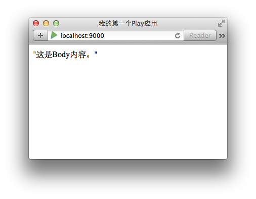

同时，因为我们修改了源代码的原因，Play会自动编译有改动的文件并重新载入（reload）。

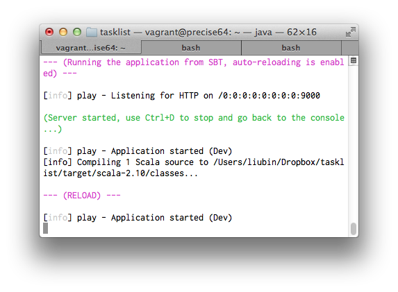

## Task管理项目

下面我们就在刚才生成的项目基础上，完成一个简单的任务管理界面。它的功能很简单，只有一个task实体，用来表示一个任务，我们会实现添加、修改、完成任务的功能。

所谓的完成认为，就是将任务设置为已完成，而不是进行物理删除。


基本上这个例子是按照官方的教程（*注 3*）来做的，主要有以下几点不一样。

- 使用SQLite而不是H2数据库
- 界面部分做了汉化
- 添加了一个done字段，去掉了删除功能
- 没有部署到heroku上

当然我想你肯定不会按照本教程一点点拷贝代码，我放了一份到Github上（*注 4*），你也可以直接从这里clone下来用。

*注 3：官方教程网址 <http://www.playframework.com/documentation/2.2.x/ScalaTodoList>*  
*注 4：Github地址 <https://github.com/liubin0329/play-todo>*

### 准备数据库

首先我们先来配置数据库。

#### 安装SQLite驱动

Play提供了JDBC或者Anorm来访问数据库，JDBC大家应该很熟悉了，Anorm是一个数据访问层，它使用标准的SQl和数据库交互，不是一个ORM框架。

Play使用SBT进行构建管理，顺便帮我们解决了库依赖问题。不过我们这里要用到的SQLite数据库的驱动还只能自己下载后放到`lib`文件夹下。

SQLite驱动下载地址可以来这里：<https://bitbucket.org/xerial/sqlite-jdbc/downloads>。不过最新版的``在Mac下不能使用，会出现`java.lang.NoClassDefFoundError: org/sqlite/NativeDB`错误，需要换成3.7.2版本（sqlite-jdbc-3.7.2.jar）的。

之后，需要将这个jar文件放到`lib`文件夹下。

```
$ cp ~/Downloads/sqlite-jdbc-3.7.2.jar lib/
```

创建一个SQLite的数据库，像下面这样。

```
$ mkdir db

$ sqlite3 db/tasks.db
SQLite version 3.7.13 2012-07-17 17:46:21
Enter ".help" for instructions
Enter SQL statements terminated with a ";"

sqlite> .databases
seq  name             file
---  ---------------  ----------------------------------------------------------
0    main             /Users/liubin/Dropbox/tasklist/db/tasks.db
sqlite>
```

#### 修改配置文件

之后，在配置文件中指定所使用的数据库信息。SQLite的话需要的配置项比较少，只有下面两个就够了。

```
+db.default.driver=org.sqlite.JDBC
+db.default.url="jdbc:sqlite:/Users/liubin/Dropbox/tasklist/db/tasks.db"
```

注意上面的数据库文件地址需要写绝对路径。


#### 准备建表SQL语句。

新建文件`cat conf/evolutions/default/1.sql`，内容如下。

```
# Tasks schema

# --- !Ups

CREATE TABLE tasks (
  id INTEGER PRIMARY KEY AUTOINCREMENT,
  label VARCHAR(255),
  done BOOLEAN default FALSE
);

# --- !Downs

DROP TABLE tasks;

```

#### 执行Evolutions

在准备工作都做好之后，我们再去浏览器访问一下我们的主页，会出现如下消息。

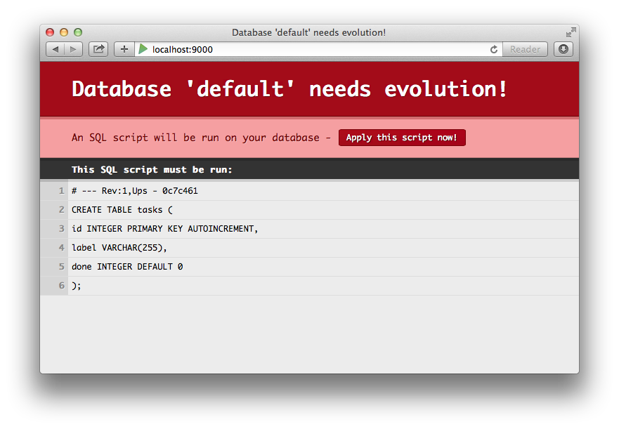


点击上面的"Apply this script now!"按钮后，如果不出意外，会重定向到主页。同时，你可以通过命令行来确认。

```
$ sqlite3 db/tasks.db
SQLite version 3.7.13 2012-07-17 17:46:21
Enter ".help" for instructions
Enter SQL statements terminated with a ";"
sqlite> .tables
play_evolutions  tasks
sqlite> .sch tasks
CREATE TABLE tasks (
id INTEGER PRIMARY KEY AUTOINCREMENT,
label VARCHAR(255),
done BOOLEAN default FALSE
);
sqlite> .sch play_evolutions
CREATE TABLE play_evolutions (
                  id int not null primary key, hash varchar(255) not null,
                  applied_at timestamp not null,
                  apply_script text,
                  revert_script text,
                  state varchar(255),
                  last_problem text
              );
sqlite>
```

Play里值得称赞的是如果只是修改数据库配置信息的话，那么你没必要重新启动服务器。

### 创建路由规则

数据库准备好了之后，我们再看配置路由。

```
+GET     /tasks                  controllers.Tasks.list
+POST    /tasks                  controllers.Tasks.create
+POST    /tasks/:id/done         controllers.Tasks.done(id: Long)
```


### 创建Controller

我们同时新建了一个控制器`Tasks`，这里遵循了Rails的写法，用了英语单词的复数形式。

这个控制器有三个方法，分别是`list`、`create`、`done`，对应了取得任务列表、创建新任务、完成任务三种操作。控制器的代码如下，还没有加入真正的处理逻辑。

```scala
object Tasks extends Controller {

  def list = TODO
  def create = TODO
  def done(id: Long) = TODO

}

```


这时访问<http://localhost:9000/tasks>，我们会得到一个还没有实现（501 Not Implemented）的错误信息。这就是我们在Controller里面看到的`TODO`的作用了。这对于先搭好架子再慢慢实现的开发策略来说非常有帮助。

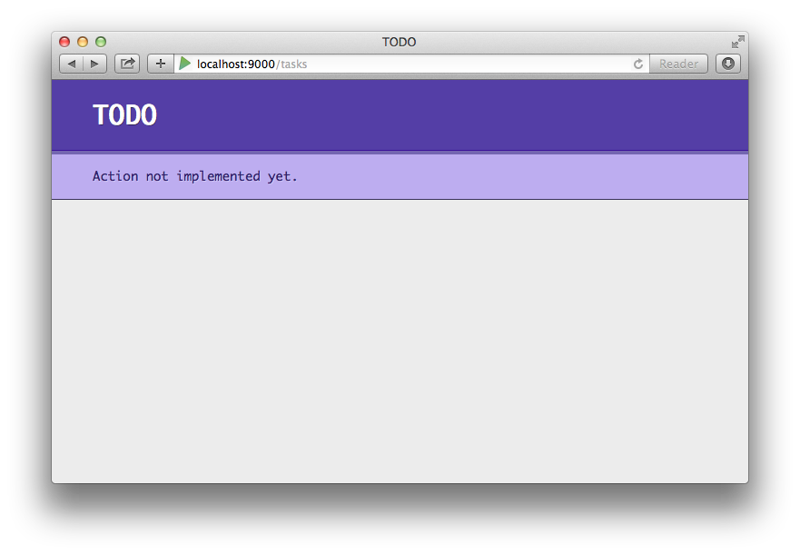

同时，我们想在浏览器访问根目录时，让它自动转向`/tasks`。这可以通过修改文件`app/controllers/Application.scala`来完成。

```scala
  def index = Action {
    Redirect(routes.Tasks.list)
  }
```

### 创建Model

我们的Model名称为`Task`，文件保存在`app/models/Task.scala`。其内容如下。


```scala
package models

import play.api.db._
import play.api.Play.current
import anorm._
import anorm.SqlParser._

case class Task(id: Long, label: String, done: Boolean)

object Task {

  val task = {
    get[Long]("id") ~
    get[String]("label") ~
    get[String]("done") map {
      case id~label~done => Task(id, label, done == "t")
    }
  }

  def all(): List[Task] = {
    DB.withConnection { implicit c =>
      SQL("select * from tasks").as(Task.task *)
    }
  }

  def create(label: String) {
    DB.withConnection { implicit c =>
      SQL("insert into tasks (label) values ({label})").on(
        'label -> label
      ).executeUpdate()
    }
  }

  def done(id: Long) {
    DB.withConnection { implicit connection =>
      SQL("update tasks set done = 't' where id = {id}").on(
        'id -> id
      ).executeUpdate()
    }
  }

}

```
这里的Task类是一个case class，同时还定义了一个伴生类（companion object），这样你就可以使用`Task.all`这样类似Java里静态方法形式的方法调用了。

`val task = ...` 这里定义的task在Anorm里被称为"parser"，它的作用是将JDBC返回来的`ResultSet`类型的数据，转换为一个Model对象，在这里是`Task`对象。

这段代码中使用了3个字段，分别是`id`、`label`、`done`，在这个定义中的`map`方法中，使用这3个字段初始化了一个`Task`对象。

注意这里传递个`Task()`的第三个参数，我们用了一个简单的返回Boolean类型的表达式，因为SQLite这个数据库里没有真正的Boolean类型的字段，需要自己定义。这里我们用't'代表true，用'f'代表false。数据库里虽然保存的是't'/'f'，但是Task对象里的该属性确实是Boolean类型的。

再来看一下这个控制器里的`all`方法。`DB.withConnection`会帮助我们连接数据库并释放连接，我们可以不用担心连接过多的问题。

然后是Anorm的`SQL`方法，它会创建并执行一条查询语句，`as`方法则使用`Task.task *`来解析（parse）一个查询结果集的每条记录，它的最终返回结果类型为`List[Task]`。

之后，我们就可以来充实一下我们的Controller了。

```scala
package controllers

import play.api._
import play.api.mvc._
import play.api.data._
import play.api.data.Forms._

import models.Task


object Tasks extends Controller {

  val taskForm = Form(
    "label" -> nonEmptyText
  )

  def list = Action {
    Ok(views.html.tasks(Task.all(), taskForm))
  }

  def create = Action { implicit request =>
    taskForm.bindFromRequest.fold(
      errors => BadRequest(views.html.tasks(Task.all(), errors)),
      label => {
        Task.create(label)
        Redirect(routes.Tasks.list)
      }
    )
  }

  def done(id: Long)  = Action {
    Task.done(id)
    Redirect(routes.Tasks.list)
  }

}

```

如果你是刚接触Play的话，那么要重点看一下Play里面是怎么处理Form的，和其它框架有一定的差别。

首先，这个控制器先定义了一个Form对象`taskForm`。一个Form对象封装了HTML里form元素的定义，还包括验证约束（validation constraints）等信息。

这里定义的`taskForm`对象非常简单，它的类型是`Form[String]`的。它只有一个`label`字段，而且这个字段是必须项，如果提交form的时候没有输入任何内容，则服务器端验证就会失败，并会设置相应的错误信息在客户端上显示。


然后再看`list`这个方法，它返回的状态码为`200 OK`，这个无需多数。它输出给客户端的内容是由模板`views.html.tasks`产生的，在调用`views.html.tasks`这个模板方法的时候，传递给它了两个参数：全部任务的列表和之前定义的`taskForm`。


当用户在页面上点击"创建"按钮的时候，会触发这个控制器里的`create`方法。

`taskForm.bindFromRequest`方法会将HTTP请求中的数据绑定到`taskForm`上，如果Form验证出现错误的话，那么会返回一个`BadRequest`对象，它会再次显示所有的任务列表，并且将`errors`传给模板以显示在浏览器上。如果表单验证一切正常，那么就创建一个新的`task`并重定向到任务列表也米昂。

`fold`方法接收两个函数：第一个将在表单绑定失败的时候被调用，第二个则在成功的时候会执行。

最后，我们再来实现View部分，模板文件保存在`app/views/tasks.scala.html`，其内容如下。

```html
@(tasks: List[Task], taskForm: Form[String])

@import helper._

@main("任务列表") {

    <h1>总任务数： @tasks.size 个</h1>

<style type="text/css">

  .done {
    text-decoration:line-through;
    background: yellow;
  }

</style>

    <ul>
        @tasks.map { task =>
            <li@(if(task.done) " class=done")>
                @task.label

                @if(!task.done) {
                  @form(routes.Tasks.done(task.id)) {
                      <input type="submit" value="完成">
                  }
                }
            </li>
        }
    </ul>

    <h2>添加新任务</h2>

    @form(routes.Tasks.create) {

        @inputText(taskForm("label"), '_label -> "任务内容")

        <input type="submit" value="创建">

    }

}

```

这里我们的模板函数会接收两个参数，第一个是所有的任务列表，第二个是用来表示任务的一个Form对象。

`@form`是一个helper方法，熟悉Rails的人应该会比较容易理解。helper类通过`@import helper._`来引入。`@form`和`@inputText`合起来就帮我们生成了一个带一个文本输入框的form标签。

最后程序执行起来会像下面这样。

没有任务的时候。

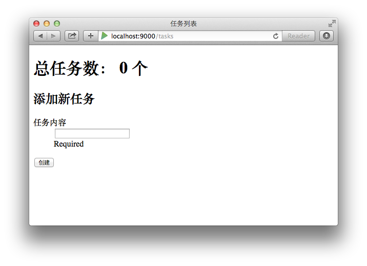

已完成和未完成的任务同时存在。

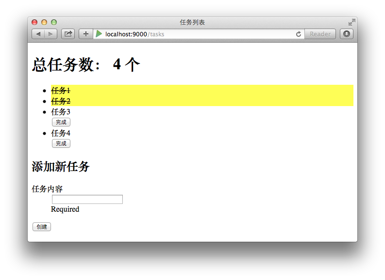


## `play`命令说明

前面我们已经使用过两次`play`命令了，分别是。

- `play new`：创建新的Play应用
- `play run`：启动Play应用服务器

如果我们不带任何参数运行`play`命令，那么就会启动Play的控制台（Play console），这个工具（Play console）还有很多其它很实用的功能，这里我们简单看几个。

Play console是基于sbt编写的，你可以用它来控制应用程序开发的整个生命周期。

### 启动Play console

要想启动Play console，必须到Play应用的目录下面。

```
$ cd /path/to/any/application
$ play
```

### 启动应用程序

前面我们已经看到了，通过`play run`能启动应用程序，让客户端访问。但通过`play run`命令启动的应用程序是在开发模式（development mode）下运行的，在开发模式下，应用的auto-reload功能会被启用，在你修改源文件之后，Play框架会自动检测并重新编译源文件，你可以不用重启服务器就能立刻看到效果。在编译出错的时候，你会同时在浏览器和控制台上看到具体的出错信息，这也非常方便开发和调试应用。

要想在生产环境下运行，需要使用`play start`命令启动应用程序。在Play控制台下输入`start`，这是在生产环境下启动应用的最简单的方法。

[tasklist] $ start

在执行start后，Play会重新fork一个新的JVM出来，并在里面启动默认的Netty HTTP服务器。这时候新JVM的标准输出会被重定向到Play控制台（Play console），你可以在这里监视所有输出。

这事是服务器的进程ID会被打印到控制台，同时被写到`RUNNING_PID`文件，你可以通过给这个进程发送一个SIGTERM信号来终止它的运行。

如果你通过Ctrl+D退出了控制台，但是运行HTTP服务器的JVM不会自动退出，还会在后台继续运行，这时候它的标准输出已经被关闭，你只能从`logs/applications.log`里读取日志了。

如果你想同时退出Netty服务器和Play console，可以使用Ctrl+C的组合键操作，它可以同时终止两个JVM的运行。

当然，你也可以直接在终端窗口里执行`play start`命令。

$ play start

### 编译

当然你也可以只编译源代码而不启动服务器。这你可以运行`compile`。

[tasklist] $ compile

### 交互式控制台（interactive console）

你可以运行`console`命令，来启动一个交互式的Scala控制台。

[tasklist] $ console
To start application inside scala console (e.g to access database):
bash scala> new play.core.StaticApplication(new java.io.File("."))


### 清空缓存

在sbt缓存被破坏后导致系统不正常的时候，你可能希望能将所有缓存都删除。你可以在终端窗口里执行`play clean-all`命令。

$ play clean-all
